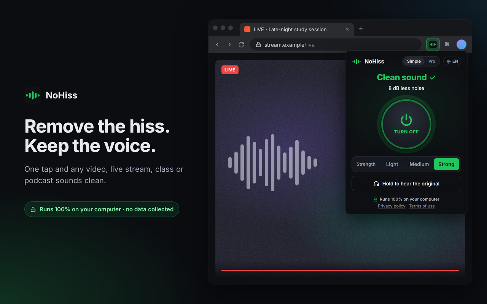

# NoHiss 🎧

A Chrome extension that **removes hiss and background noise from any tab's audio, in real time** — livestreams, videos, recorded classes, podcasts.

**[Install NoHiss from the Chrome Web Store](https://chromewebstore.google.com/detail/dncenkgelggalfgabeinbjeginhmcfgo)** · free · runs 100% on your computer · 20 languages



Press the big button and it starts cleaning right away. Without a saved profile, it also listens to the first 30 seconds and estimates, band by band, the sound that is there all the time, then reduces that pattern while aiming to preserve voice and music. In **Pro**, **Scan** goes further: it lists constant sounds it found (hiss, mains hum, a whine, a steady beep…) and you pick which ones to remove. Everything runs on your computer.

## Features

- **Simple and Pro.** Simple is one big on/off button plus Light / Medium / Strong. Pro shows the filters, the hiss fingerprint, Scan and the exact strength.
- Works on the page you open it on, with one click.
- **Two filters:**
  - **Hiss** (default): spectral subtraction built for constant noise (bad mic, tape, radio). Uses gentler attenuation and smooth transitions to help preserve voice and music.
  - **Voice (AI):** [RNNoise](https://github.com/xiph/rnnoise), a neural network trained on voice. Removes varying noise, but may wipe out music.
- **Learns the hiss automatically** in the first 30 s, with a "hiss fingerprint" chart of the noise spectrum it found. The profile is saved for next time.
- **Scan (Pro):** lists every constant sound with its level and a spectrum chart — mains hum with its harmonics, steady tones, high-pitched whines, hiss, background noise, rumble. Check what you want removed; it applies right away and leaves the rest alone.
- **Strength:** starts at 60%; Hiss limits per-band attenuation to 18 dB at full strength. Voice (AI) retains at least 10% of the time-aligned original audio to soften model dropouts. Some residual noise is intentional.
- **A/B comparison:** hold the button to hear the original.
- Meter showing how much hiss is being removed.
- ~21 ms of processing latency in Hiss and ~30 ms in Voice (AI), plus browser/device buffering.

## Install

The easiest way is the **[Chrome Web Store](https://chromewebstore.google.com/detail/dncenkgelggalfgabeinbjeginhmcfgo)**. To run it from the source code instead (developer mode):

1. Download or clone this folder.
2. Open `chrome://extensions`.
3. Turn on **Developer mode** (top-right corner).
4. Click **Load unpacked** and select the project folder.
5. Pin the icon, open the page with the video or stream, click the icon and press the big button.
6. It cleans right away and fine-tunes itself during the first 30 s. To choose exactly what to remove, switch to **Pro** and open **Scan**.

Works on Chrome 116+ and Chromium-based browsers (Edge, Brave, Opera).

### If speech sounds robotic

Start with Hiss at 60% and compare using the original-audio button. Lower the strength if consonants or word endings sound metallic. Use Voice (AI) for speech with varying noise; it can still damage music or unusual voices. A saved strength is preserved on upgrade, so lower it manually if needed. Learn the hiss again when switching to a recording with different background noise; a profile learned from continuous speech or music can include wanted content.

The smoother settings trade stronger noise removal for better preservation of quiet sounds. They cannot reconstruct speech already damaged in the source recording.

## How it works

```
Tab (stream) ──tabCapture──▶ Offscreen document ──▶ AudioWorklet ──▶ Speakers
                                   ▲                (Hiss or RNNoise)
Popup ──messages──▶ Service worker
```

| File | What it does |
|---|---|
| `manifest.json` | Manifest V3; `tabCapture`, `offscreen` and `storage` permissions; CSP allowing WebAssembly. |
| `background.js` | Service worker. Gets the tab's *stream id*, creates the offscreen document, handles on/off and stores the learned profile. |
| `offscreen/` | Hidden document that opens the tab audio (the MV3 service worker has no Web Audio). |
| `audio/pipeline.js` | Web Audio graph at 48 kHz and switching between filters. |
| `audio/spectral-processor.js` | The hiss filter and the scan — details below. |
| `audio/components.js` | Turns a scan into a list of constant sounds, and a selection into what the filter removes. |
| `audio/rnnoise-processor.js` | The AI filter, RNNoise in WebAssembly. |
| `popup/` | The UI. |

### The hiss filter (`spectral-processor.js`)

1. **1024-point FFT with 75% overlap** (square-root Hann window). The audio becomes 513 frequency bands, recomputed every 5.3 ms.
2. **Noise-floor estimate for each band:**
   - *Automatic:* the lowest level over the last ~1.5 s (*minimum statistics*).
   - *Learned:* for 30 s it builds a histogram of each band's energy and takes the 10th percentile — voice and music come and go, hiss stays. The value is corrected for statistical bias (for Gaussian noise, a band's energy follows an exponential distribution).
   - *Lower envelope:* hiss is smooth across the spectrum; voice and music harmonics are narrow peaks. For each band the profile becomes the 30th percentile of its neighbors (±1/6 octave), so a long note doesn't end up in the profile as noise.
   - Digital silence (paused video) is ignored; otherwise the floor would "drop to zero" and the filter would stop working.
3. **Wiener gain with the decision-directed rule** (Ephraim–Malah): each band is lowered according to its signal-to-noise ratio, with a recovery path for sudden energy rises above the estimated noise. Neighboring bands are smoothed, and gain opens with a 5 ms time constant and closes with a 70 ms time constant. Per-band attenuation is capped at 18 dB to reduce loss of quiet content; this does not guarantee artifact-free audio.
4. **Overlap-add reconstruction.**

### The scan (`components.js`)

The same 30 s pass that learns the hiss also looks for every sound that stays on the whole time:

- **Broadband:** the learned floor split into rumble (< 200 Hz), background noise (200 Hz – 2 kHz) and hiss (> 2 kHz).
- **Tones:** a separate 4096-point analysis (11.7 Hz per band) of the mono mix. The scan is cut into ten ~3 s blocks; in each block it keeps every band's *minimum* over all frames, then takes the median across blocks. A steady tone keeps its level in every single frame and survives; voice and music drop out between syllables and notes.
  - The level comes from a 20th-percentile spectrum (the minimum reads low).
  - The exact frequency comes from how much each band's phase advances between frames, averaged over the quiet frames of the scan (phase-vocoder style). It's accurate to about 0.1 Hz, far finer than the 11.7 Hz bands.
  - Mains hum is grouped with its harmonics (50 or 60 Hz) and snapped to the grid frequency.

Removing what you picked (custom mode): broadband sounds go through the spectral filter with a fixed profile made only of the picked ranges; tones go through narrow notch filters (3 Hz wide at 60 Hz, 0.4% of the frequency higher up), so almost nothing around them is touched.

### Why not just RNNoise?

The first version used only RNNoise. On a real stream it removed the voice along with the hiss, and in tests with sustained chords + hiss it kept only 12% of the music's level. RNNoise decides what is voice based on its training; when a sound doesn't look like what it knows, it gets cut. Hiss is constant and predictable, so a filter that *measures* the noise works better and leaves the rest alone.

## Test results

### Current regression checks

Run `node --test tests/audio.test.mjs` with Node.js 22 or later; no dependencies are needed. The eight tests exercise the processor code and bundled RNNoise WebAssembly in a simulated AudioWorklet environment: delayed stereo bypass, zero strength, silence, learned-noise attenuation with synthetic syllables, empty custom selection, the AI dry reserve, and measured RNNoise latency. These are signal-level checks, not a Chrome playback or listening evaluation.

On a deterministic synthetic harmonic signal with pauses and white hiss, at 80% strength and with a known noise profile, the revised Hiss filter retained about 0.97 of the reference signal's level (previously 0.93), while pause-noise reduction changed from about 28 dB to 12 dB. These values describe that synthetic fixture only; they do not establish perceived quality on real speech.

### Historical benchmarks (before the smoother settings)

The results below were recorded for the earlier, more aggressive filter. They have not been reproduced for the revised settings and should not be treated as current performance claims.

AudioWorklet in Chromium, synthesized speech + hiss (10 dB SNR), 45 s of audio:

| | Hiss in pauses | Voice (gain) | Speech SNR |
|---|---|---|---|
| Original | −21 dB | — | 10.8 dB |
| **Hiss filter (learned, 100%)** | **−52 dB** | **0.92** | **19.0 dB** |
| RNNoise | −50 dB | 0.96 | 14.3 dB |

- The learned hiss level matched the real one: −21.0 dB measured vs. −21.0 dB actual.
- With music instead of voice, the Hiss filter kept the music nearly intact (−1 to −2 dB) while RNNoise cut 4 to 6 dB.
- In "original" mode (bypass), the output is identical to the input.

**Scan**, same speech plus hiss (−40 dB), 60 Hz hum with harmonics at 120/180/300 Hz, a 1 kHz beep (−60 dB) and a 15.7 kHz whine (−55 dB):

| Sound | Found as | Removed when picked |
|---|---|---|
| 60 Hz hum + harmonics | Mains hum, 60 Hz + 3 harmonics, −37 dB | fully (> 60 dB) |
| 1 kHz beep | Steady tone, 1000 Hz, −61 dB | −28 dB |
| 15.7 kHz whine | High-pitched whine, 15.7 kHz, −56 dB | −60 dB |
| Hiss | Hiss, 2–24 kHz, −40 dB | −22 dB |

The voice kept 99% of its level with all tones notched. Speech with only hiss, and music with changing notes, produced no tones. A synthetic loop of the same few chords did show two of its notes as steady tones, which is exactly why the scan lets you choose: you see them and leave them unchecked.

## Languages

The popup is available in 20 languages: English, Portuguese, Spanish, French, German, Italian, Dutch, Polish, Turkish, Russian, Ukrainian, Arabic (right-to-left), Hindi, Indonesian, Vietnamese, Thai, Japanese, Korean, Simplified and Traditional Chinese. It follows Chrome's language automatically; the globe menu in the header switches it, and the choice is remembered. The strings live in `popup/locales/<code>.json`.

The extension's name and short description are translated into the 53 languages the Chrome Web Store supports (`_locales/`), so the store page shows them in the visitor's language.

## Limitations

- Noise that keeps changing (keyboard, traffic) isn't "hiss" — the Voice (AI) mode works better for that.
- Internal pages (`chrome://`) and the Chrome Web Store can't be captured.
- One tab at a time.

## Ideas

- Keyboard shortcut to toggle.
- Per-site profiles.
- Publish on the Chrome Web Store.

## Privacy

NoHiss processes tab audio locally and does not send audio, noise profiles or preferences to the developer. It saves no raw audio recordings and has no server-side user database or telemetry. Preferences, learned noise profiles and scan results are saved locally in the browser; the active tab ID is kept in session storage. This is local storage, not an absence of data processing or storage. The privacy policy links to the relevant source files so this behavior can be inspected.

The bilingual [privacy policy](docs/index.html) is bundled with the extension and available from the popup. Privacy and support contact: [joaoestella.dev@gmail.com](mailto:joaoestella.dev@gmail.com).

For GitHub Pages, select **Settings → Pages → Deploy from a branch → main → /docs** and save. Once the deployment completes, the policy will be available at [https://joaoestella.github.io/NoHiss/](https://joaoestella.github.io/NoHiss/). Use that published URL in the Chrome Web Store privacy policy field.

## Terms of use

The bilingual [Terms of Use](docs/terms.html) describe filtering artifacts, bugs, user conduct and limitations of warranties and liability to the extent permitted by applicable law. They do not waive mandatory rights or guarantee immunity from liability. They are bundled with the extension and linked from its popup.

## Credits and licenses

- **RNNoise**, by Jean-Marc Valin and other contributors: noise suppression library, distributed under BSD-3-Clause. See the [full RNNoise license and copyright notices](audio/vendor/RNNOISE-LICENSE.txt).
- **Jitsi rnnoise-wasm**: WebAssembly packaging of RNNoise, distributed under Apache-2.0 with the upstream historical notices preserved. See the [full Jitsi license and notices](audio/vendor/RNNOISE-WASM-LICENSE.txt).

See [THIRD_PARTY_NOTICES.md](THIRD_PARTY_NOTICES.md) for the upstream projects, pinned revisions, attribution and integrity information. Keep that file and both license files in extension release packages. Their inclusion does not imply endorsement of NoHiss by the upstream authors.

The third-party licenses apply to their respective components; they do not establish a license for NoHiss's own code.
